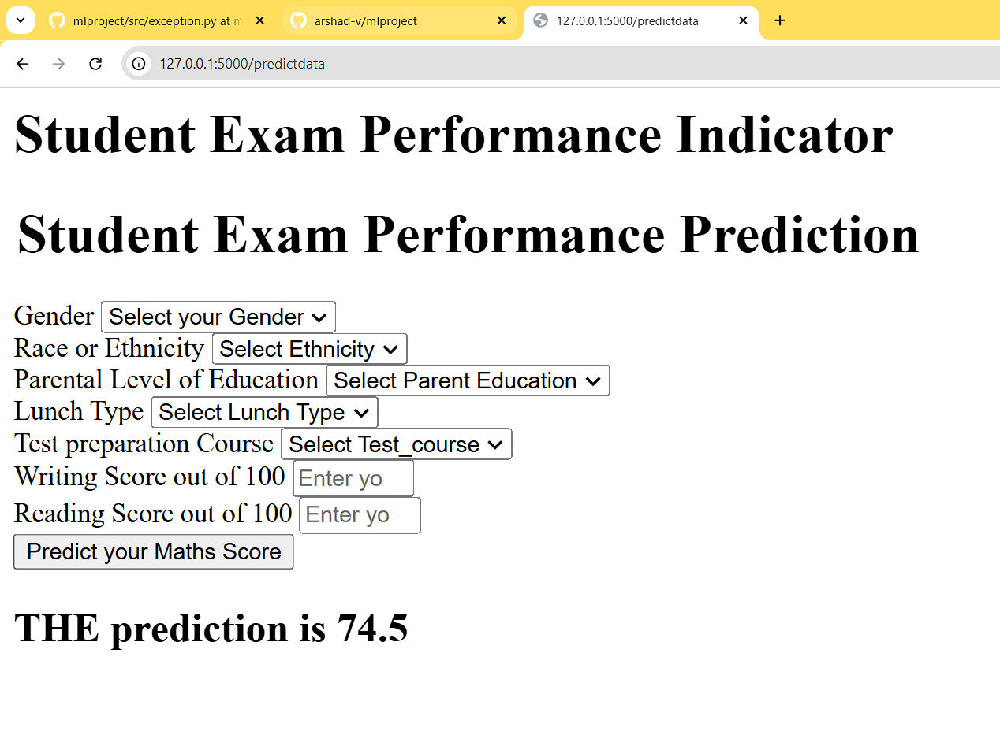

# Student Performance Predictor

## Project Overview
This is a machine learning project that predicts student performance based on various demographic and academic factors. The project includes a complete ML pipeline from data preprocessing to model deployment with a Flask web interface.

## Application Interface

*Web interface for predicting student performance based on various factors*

## Features
- Predicts student performance based on multiple input parameters
- Web interface for easy interaction
- Complete ML pipeline implementation
- Logging and custom exception handling
- Modular code structure following best practices

## Tech Stack
- Python
- Flask
- Scikit-learn
- Pandas
- NumPy
- HTML/CSS

## Project Structure
```
├── .ebextensions/          # Elastic Beanstalk configuration
├── artifacts/              # Model artifacts and data files
├── images/                 # Screenshot images
├── logs/                   # Application logs
├── notebook/               # Jupyter notebooks for analysis
├── src/                    # Source code
│   ├── components/         # Core ML components
│   ├── pipeline/          # Training and prediction pipelines
│   ├── utils.py           # Utility functions
│   ├── logger.py          # Logging configuration
│   └── exception.py       # Custom exception handling
├── templates/             # HTML templates
├── app.py                 # Flask application
├── setup.py              # Project setup configuration
└── requirements.txt      # Project dependencies
```

## Installation
1. Clone the repository
2. Create a virtual environment:
   ```
   python -m venv venv
   ```
3. Activate the virtual environment:
   ```
   source venv/bin/activate  # For Linux/Mac
   venv\Scripts\activate     # For Windows
   ```
4. Install dependencies:
   ```
   pip install -r requirements.txt
   ```

## Usage
1. Run the Flask application:
   ```
   python app.py
   ```
2. Open your browser and navigate to `http://localhost:5000`
3. Enter the required student information in the web form:
   - Gender
   - Race/Ethnicity
   - Parental Level of Education
   - Lunch Type
   - Test Preparation Course
   - Reading Score
   - Writing Score
4. Click "Predict" to get the performance score

## Development
- The project follows a modular structure
- Custom exception handling and logging are implemented
- Model training pipeline is available in the notebooks directory
- Prediction pipeline is implemented for real-time predictions

## Author
- Arshad

